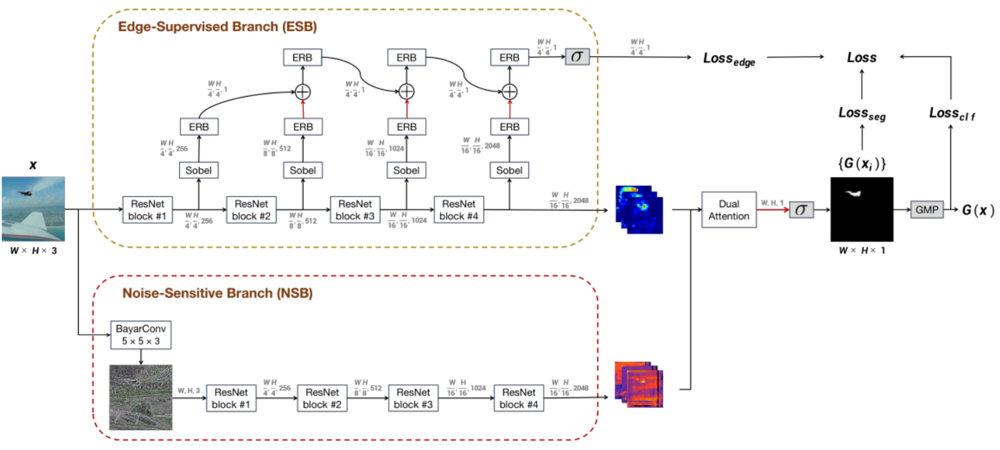
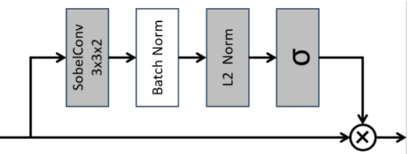
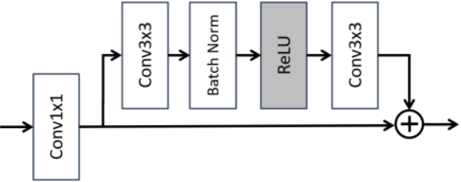
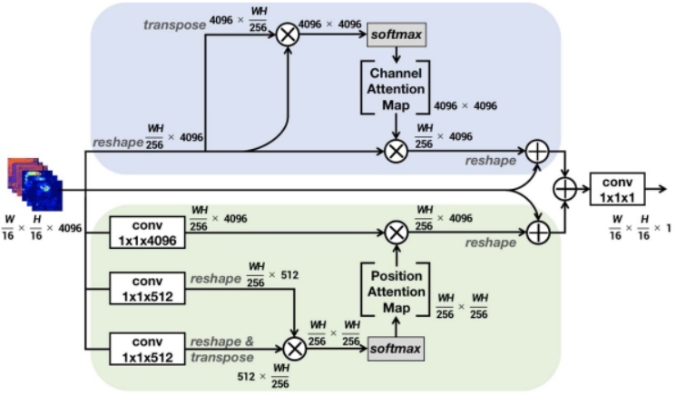
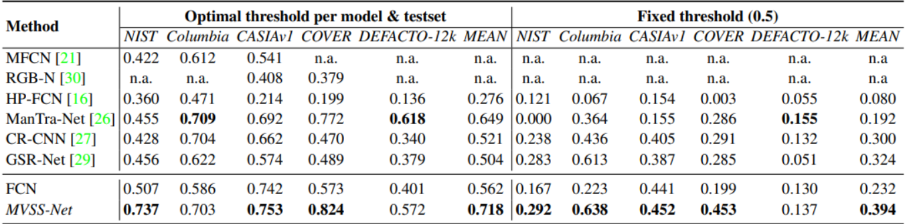
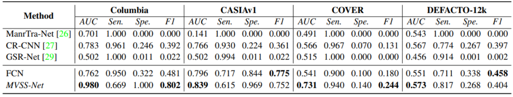
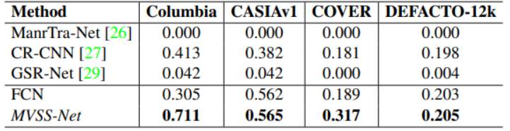

# Report on "Image Manipulation Detection by Multi-View Multi-Scale Supervision"
[paper](https://arxiv.org/pdf/2104.06832v2.pdf)

[official code](https://github.com/dong03/MVSS-Net)
## Introduction
Digital images can now be manipulated with ease and
often in a visually imperceptible manner. This article target the following types of manipulations: copy-move (copy and move elements from one region to another region in a given image), splicing (copy elements from one image and paste them on another image) and inpainting (removal
of unwanted elements). Authors present method for classifying and segmenting those regions.
Most of the recent approaches focus on sensitivity metric, but for practical use specificity is important too. That's why authors present their more generalizable algorithm: MVSS-Net.

## High-level description
Authors categorize existing methods into two groups: noise-view methods and edge-supervised methods. 
Given the hypothesis that novel elements introduced by slicing and/or inpainting differ from the authentic part in terms of their noise distributions, the first group of methods aim to exploit such discrepancy.
But these methods are ineffective for detecting copymove which introduces no new element.
The second group of methods concentrates on finding boundary artifact as manipulation trace around a tampered region, implemented by adding an auxiliary branch to reconstruct the region’s edge. 
But these methods can be poorly generalizable. 

That's why authors introduce a new model combining the best of the two worlds. Also for checking the generalization of this approach they experimented with 2 training sets and 5 test sets. Model doing well compare to state-of-the-art methods.

## Detailed description
**Multi-View Feature Learning**

MVSS-Net consists of two branches, with ResNet-50 as their backbones. The edge-supervised branch (ESB) at the top is specifically designed to exploit subtle boundary artifact around tampered regions, whilst the noise-sensitive branch (NSB) at the bottom aims to capture the inconsistency between tampered and authentic regions. Both clues are meant to be semantic-agnostic.

**Edge-Supervised Branch**

The main challenge is how to construct an appropriate input for the edge detection head:
 - directly using features from the last ResNet block:

this will enforce the deep features to capture low-level edge patterns and consequently affect the main task of manipulation segmentation

 - using features from the initial blocks:

this is also very questionable, because subtle edge patterns may vanish after multiple deep convolutions.

So, need to use all features, but not simply concatenating them. 

Authors propose their algorithm:

    1. features from i-th block goes through Sobel layer:

    2. then goes into edge residual block(ERB):

    3. to prevent the effect of accumulation, the combined features go through another ERB before the next round of feature combination

The output of ESB has two parts:

1. Feature maps from the last ResNet block for the main task
$${f_{esb,1}, . . . , f_{esb,k}}$$

2. Predicted manipulation edge map
$${G_{edge}(xi)}$$

**Noise-Sensitive Branch**

For noise extraction authors use [BayarConv](https://ieeexplore.ieee.org/stamp/stamp.jsp?tp=&arnumber=8335799) and after that ResNet blocks.

Output is k feature maps from last block:
$${f_{nsb,1}, . . . , f_{nsb,k}}$$

This branch is parallel with Edge-Supervised Branch

**Branch Fusion by Dual Attention**

At this point we have two arrays:
$${f_{esb,1}, . . . , f_{esb,k}} \;\; and \;\; {f_{nsb,1}, . . . , f_{nsb,k}}$$

Previous work uses non-trainable bilinear pooling for feature fusion.

Authors uses a trainable Dual Attention (DA) module.

The DA module has two attention mechanisms working in parallel: 
 - channel attention (CA):
associates channel-wise features to selectively emphasize interdependent channel feature maps
 - position attention (PA):
selectively updates features at each position by a weighted sum of the features at all positions

Outputs are summed up and transformed in a new feature map, then transformed into a final segmentation map with bilinear upsampling and element-wise sigmoid.

**Multi-Scale Supervision**

Authors consider losses at three scales:
1. **pixel-scale loss** for improving the model’s sensitivity for pixel-level manipulation detection = Dice loss:

$$loss_{seg}(x) = 1 −  \frac{2\sum_{i=1}^{W×H}G(x_i)·y_i}{\sum_{i=1}^{W×H}G(x_i)^2 + \sum_{i=1}^{W×H}y_i^2}$$

2. **edge loss** for learning semantic-agnostic features = again Dice loss:

like pixel-scale loss but with size of feature maps: $\frac{W}{4}\times\frac{H}{4}$, that reduces computational cost during training and improves the performance slightly

3. **image-scale loss** for improving model’s specificity for image-level
manipulation detection = BCE loss:
$$loss_{clf} (x) = −(y ·log G(x)+(1−y)·log(1−G(x)))$$

**Final loss**:
$$Loss = α·loss_{seg} + β ·loss_{clf} + (1−α−β)·loss_{edg}$$

Authentic images are only used to compute $loss_{clf}$

## Results and metrics

For *pixel-level* manipulation detection, authors compute pixel-level precision and recall, and report their F1 score.

For *image-level* manipulation detection, in order to measure the miss detection rate and false alarm rate, authors report sensitivity, specificity and their F1.

Overall performance is measured by Com-F1: harmonic mean of pixel-level and image-level F1, but it scores 0 when either pixel-F1 or image-F1 is 0.

Pixel-level results:

Image-level results:

Com-F1, the harmonic mean of pixel-level F1 and image-level F1

## Ideas for improvement
* One way to improve the proposed approach is to use instead of ResNet block transformer-based backbone: latest success transformers in CV prompts thought of using it. 

* If we consider the task of image manipulation detection in a product context, it is necessary to make it faster, for which a lightweight backbone can be used. Backbones that use fewer parameters and operations can significantly speed up the model's operation. For example, MobileNet, EfficientNet, ShuffleNet.